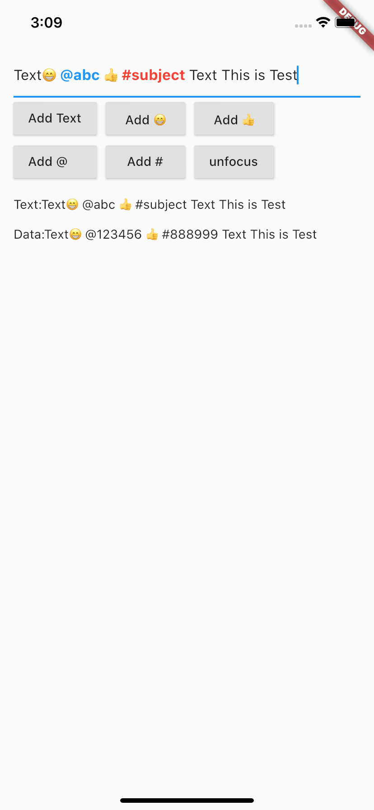

# rich_input

This is a high performance rich media input box, implemented through the native textfield extension, with less disruptive, but at the same time has a strong extensibility, implements the @ someone, # topics, expressions and other functions, support custom color highlighting

Language: [English](README.md) | [中文简体](README-ZH.md)

## Special feature

-   Use native textfield capabilities with less code, less disruption and subsequent compatibility
-   Support @someone #topic and insert emojis, etc
-   Support for custom highlighting, and custom styles
-   Support for using the backspace key to delete entire special text blocks
-   Support for special character handling
-   Support for custom data fields to enhance rich text



## Getting Started

Core code

```dart
import 'package:rich_input/rich_input.dart';

RichInputController controller = RichInputController(text: "Text");

const block = RichBlock(
  text: "@somebody",
  data: "@123456",
  style: TextStyle(color: Colors.blue),
);
controller.insertBlock(block);

// Get custom data
print(controller.data);
// Get text
print(controller.text);

// RichInput(controller: controller);
```

Example

```dart
import 'package:flutter/material.dart';
import 'package:rich_input/rich_input.dart';

void main() {
  runApp(MyApp());
}

class MyApp extends StatelessWidget {
  @override
  Widget build(BuildContext context) {
    return MaterialApp(
      title: 'Flutter Demo',
      home: MyHomePage(),
    );
  }
}

class MyHomePage extends StatefulWidget {
  @override
  _MyHomePageState createState() => _MyHomePageState();
}

class _MyHomePageState extends State<MyHomePage> {
  RichInputController _controller;
  FocusNode _focusNode;

  @override
  void initState() {
    _focusNode = FocusNode();
    _controller = RichInputController(text: "Text");

    // Refresh text display, not required
    _controller.addListener(() {
      setState(() {});
    });
    super.initState();
  }

  @override
  Widget build(BuildContext context) {
    return Scaffold(
      body: SafeArea(
        child: Padding(
          padding: const EdgeInsets.all(15),
          child: Column(
            crossAxisAlignment: CrossAxisAlignment.start,
            children: <Widget>[
              RichInput(
                focusNode: _focusNode,
                controller: _controller,
              ),
              Wrap(
                spacing: 10,
                children: [
                  RaisedButton(
                    onPressed: () {
                      _controller.insertText("Text");
                    },
                    child: const Text("Add Text"),
                  ),
                  RaisedButton(
                    onPressed: () {
                      _controller.insertText("😁");
                    },
                    child: const Text("Add 😁"),
                  ),
                  RaisedButton(
                    onPressed: () {
                      _controller.insertText("👍");
                    },
                    child: const Text("Add 👍"),
                  ),
                  RaisedButton(
                    onPressed: () {
                      const block = RichBlock(
                        text: "@abc",
                        data: "@123456",
                        style: TextStyle(
                          color: Colors.blue,
                          fontWeight: FontWeight.bold,
                        ),
                      );
                      _controller.insertBlock(block);
                    },
                    child: const Text("Add @    "),
                  ),
                  RaisedButton(
                    onPressed: () {
                      const block = RichBlock(
                        text: "#subject",
                        data: "#888999",
                        style: TextStyle(
                          color: Colors.red,
                          fontWeight: FontWeight.bold,
                        ),
                      );
                      _controller.insertBlock(block);
                    },
                    child: const Text("Add #"),
                  ),
                  RaisedButton(
                    onPressed: () {
                      _focusNode.unfocus();
                    },
                    child: const Text("unfocus"),
                  )
                ],
              ),
              const SizedBox(height: 10),
              Text("Text:${_controller.text}"),
              const SizedBox(height: 10),
              Text("Data:${_controller.data}"),
            ],
          ),
        ),
      ),
    );
  }
}
```

> [For detailed examples](example/lib/main.dart)
